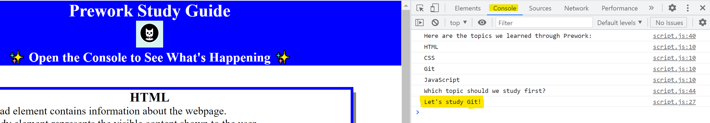

# Prework Study Guide Webpage

## Description

The Uconn Coding Boot Camp Full Stack Web Development Course covers a wide range of skils to succeed as a web development professional. This course will cover many topics including but not limited to Deployment and Delivery, Browser Based Technologies and Computer Sciense applied to JavaScript. 

The purpose of this prework study guide is to cover some of the high level topics reviewed in the course prework before class oficially kicks off.  

Having a basic understanding of some of the primary building blocks covered in the Full Stack Web Developmenet Course will lead to a successful start of the programing. 

This Prework Study Guide covers some of the basic information relating to HTML, CSS, Git, and JavaScript. 

## Installation

N/A

## Usage

To use this Prework Study Guide, navigate to the section which you would like to review. Sections include HTML, CSS, Git, and JavaScript. For suggestions on what to study first, open the Chrome DevTools by right cliking anywhere in the webpage and select "Inspect".

A console panel should open either below or to the side of the webpage in the browser. There you will see a list of topics we learned from the prework along with a suggestion on which topic to study first.

## Credits

N/A

## License

MIT License

Copyright (c) 2022 lynnadelesadler

Permission is hereby granted, free of charge, to any person obtaining a copy
of this software and associated documentation files (the "Software"), to deal
in the Software without restriction, including without limitation the rights
to use, copy, modify, merge, publish, distribute, sublicense, and/or sell
copies of the Software, and to permit persons to whom the Software is
furnished to do so, subject to the following conditions:

The above copyright notice and this permission notice shall be included in all
copies or substantial portions of the Software.

THE SOFTWARE IS PROVIDED "AS IS", WITHOUT WARRANTY OF ANY KIND, EXPRESS OR
IMPLIED, INCLUDING BUT NOT LIMITED TO THE WARRANTIES OF MERCHANTABILITY,
FITNESS FOR A PARTICULAR PURPOSE AND NONINFRINGEMENT. IN NO EVENT SHALL THE
AUTHORS OR COPYRIGHT HOLDERS BE LIABLE FOR ANY CLAIM, DAMAGES OR OTHER
LIABILITY, WHETHER IN AN ACTION OF CONTRACT, TORT OR OTHERWISE, ARISING FROM,
OUT OF OR IN CONNECTION WITH THE SOFTWARE OR THE USE OR OTHER DEALINGS IN THE
SOFTWARE.